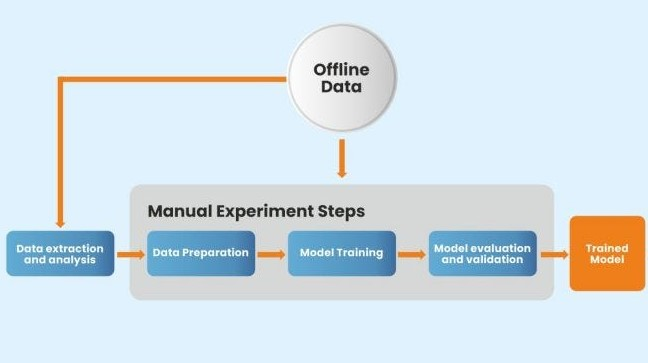

# Analysation and Regression model

## 📖 Table of Contents
1. [Introduction](#introduction) 📌 
2. [Description](#description) 📜 
3. [Project Structure](#project-structure) 🚀 
4. [Installation](#installation) 🔧 
5. [Results](#results) 📊 
6. [Completion](#completion) 🏁 

## 📌 Introduction
This project as part of the AI Bootcamp @becode.org in Gent aims to analyse and build regression model from the data scraped in previous project. 

## 📜 Description

This project contains two parts:
### 🔎 Analysation (data exploration)  
* Cleaning the process
* Finding insights and answers for some of the client questions
* Findings of relationship between price and other variables
   
### 🧱 Regression (model building)  
* LinearRegression
* DecisionTreeReg
* NeighborsReg
* xgboostReg
* RandomForestReg

## 🚀 Project Structure

## 🔧 Installation

* clone the repository
* install the specified modules within the required environment 

## 📊 Results  
Extracted the best regression model as pickle file (which is in model building folder)

## 🏁 Completion 
* Name - Mythili Palanisamy
* Submission - 20/07/2023 4:30 PM
* Team type - solo

